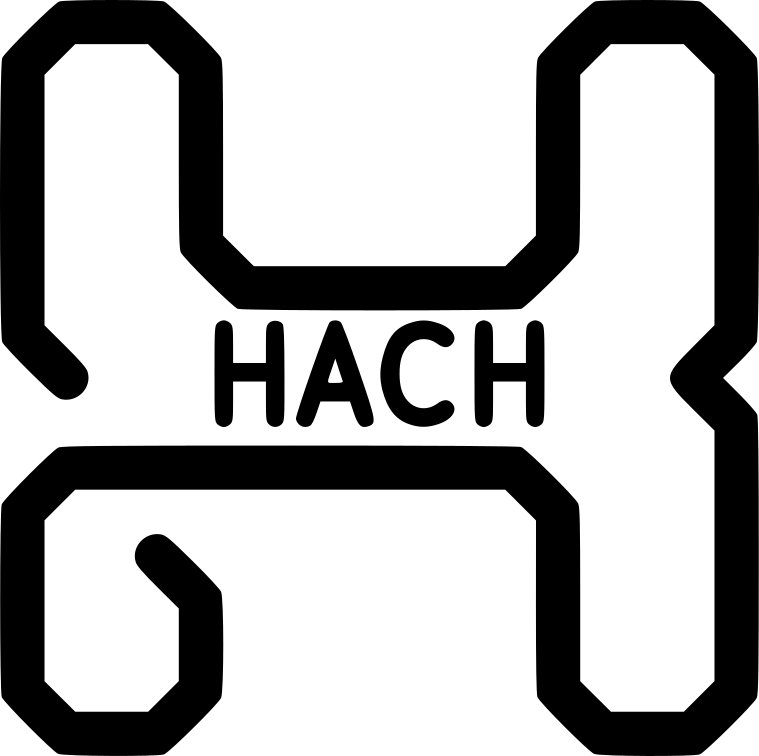

# HACH

Home Automation Control Hardware

A Control Module and collection of Extension Modules which link together for the purposes of controlling lighting and other equipment using ESPHome and Home Assistant.

The Control Module has an esp32 as the main microcontroller, ethernet, RS485, zero cross detection, i2c link ports with extender chips, 2 programmable LEDs, 2 programmable tactile switches, and programming header. The board is powered by a 100-240vac supply. Link power to extension modules and all other board power is 3.3v. The esp32 is designed to run ESPHome firmware. The RS485 port can be used to communicate with modbus enabled equipment such as solar PV systems.

The SSR Output Module can be linked to the Control Module using an RJ45 patch lead. The Module can then be used to switch or dim mains voltage lamps up to 2amps. All 8 output channels are individually fused and individually controlled.

The Switch Input Module is used to attach standard toggle light switches, retractive light switches, push buttons, dry contacts volt free contacts. All 16 inputs have hardware pullup and debounce. Each input has 2 screw terminals, one for common ground and the other for the input signal. Devices can be wired in low voltage multicore cables, for example, 8 core intruder alarm cable. The Module can be linked to the Control Module using an RJ45 patch lead.

The Switch & SSR Module are a combination of the SSR Module and the Switch Input Module. It has 12 inputs and 4 outputs. The module is linked to the Control Module using an RJ45 patch lead.

The 4chPro Adapter allows the use of a Sonoff 4ch Pro as the Control Module. The adapter is soldered to the program port inside the Sonoff and provides a RJ45 link port to expand the capabilities of the Sonoff by adding the Switch Inputs Module, SSR Output Module and/or the Switch and SSR Module.

All Boards are designed to fit in Phoenix Contact UM 72 profile din rail mounts. The hardware can then be mounted inside a control panel. The hardware is versatile and can be used for many tasks other than just lighting, such as heating controls.

This hardware is in the development stage. PCBs are still being designed. I hope to have some prototype boards produced and bench tested in early 2023.
The plan is to start producing small runs of the devices for sale in the future.

If you have any questions, comments, suggestions for improvement or ideas for more modules please feel free to create a discussion, I will try my hardest to answer everyone.

--UPDATE 22.01.2023--
The through hole version of the Switch Input module has been sent off to PCBWay to be printed. this will be tested within the next month.
This module is compatible with sonoff 4ch pro and other sonoff models with custom made link cable. The 4ch pro link modules have also been sent off to print.
The 4ch pro link module makes for a easy reliable connection to a sonoff 4ch pro by way of an rj45 connector. This is experimental and testing will be carried out within the next month.
All Gerber files for Switch Input Module through hole version are now available to use.
